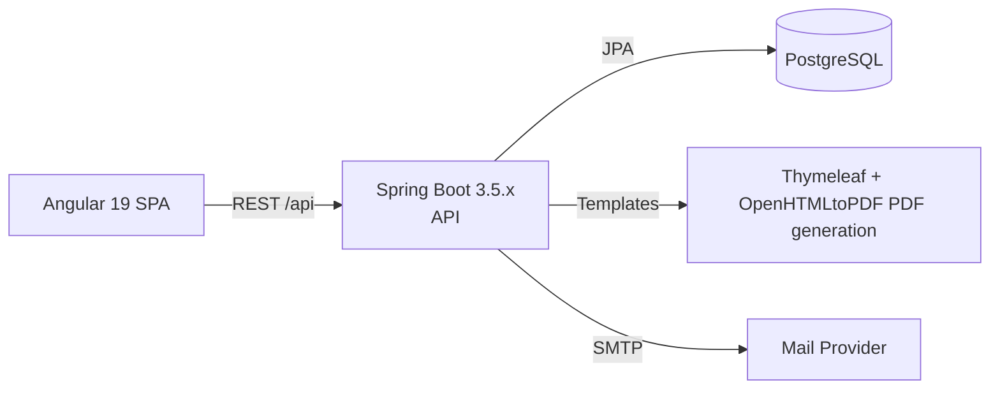

# Air-Assist.EU — Full‑Stack App ✈️


[](https://adoptium.net/) [](https://spring.io/projects/spring-boot)
[](https://angular.dev/) [](https://nodejs.org/) [](https://www.postgresql.org/)

A modern web app for managing flight delay claims and related workflows.

- Backend: Spring Boot (JWT auth, JPA/PostgreSQL, MapStruct, Caffeine cache, mailing, PDF generation)
- Frontend: Angular 19 + PrimeNG + PrimeFlex + ngx-translate (EN/RO)

---

## Table of Contents
- Quick start
- Tech stack
- Architecture
- Project structure
- Configuration (DB, mail, env)
- Development workflow
- Build & test
- i18n
- Troubleshooting

---

## Quick start
Run backend and frontend in two terminals. Commands below are for Windows PowerShell.

### 1) Backend (API at http://localhost:8080)
```powershell
# From repo root
cd backend
# Run with Maven Wrapper
.\mvnw.cmd spring-boot:run
```

macOS/Linux:
```bash
cd backend
./mvnw spring-boot:run
```

### 2) Frontend (SPA at http://localhost:4200)
```powershell
cd frontend
npm ci --no-audit --no-fund
npm start
```

The SPA calls the API at `http://localhost:8080/api` (see `frontend/src/environments/`).

---

## Tech stack
- Backend
  - Java 21, Spring Boot 3.5.x
  - Spring Data JPA (PostgreSQL), Spring Security (JWT)
  - MapStruct (DTO mapping), Caffeine (caching)
  - OpenHTMLtoPDF + Thymeleaf templates (PDF generation in `backend/src/main/resources/templates`)
  - Mail: Spring Mail + Angus/Jakarta Mail
- Frontend
  - Angular 19, PrimeNG + PrimeFlex + PrimeIcons
  - ngx-translate (i18n) with English/Romanian resources

---

## Architecture


---

## Project structure
```
backend/      # Spring Boot app
frontend/     # Angular app
```
Notable paths:
- Backend config: `backend/src/main/resources/application.properties`
- Email/PDF templates: `backend/src/main/resources/templates/`
- i18n: `frontend/src/assets/i18n/{en,ro}.json`

---

## Run

- Frontend: `cd frontend && ng serve` → http://localhost:4200
- Backend: `cd backend && ./mvnw spring-boot:run` → http://localhost:8080

---

## Build & test
- Backend
  - Build: `.\mvnw.cmd clean package`
  - Tests: `.\mvnw.cmd test`
  - Jar output in `backend/target/`
- Frontend
  - Build: `npm run build`
  - Tests (Karma/Jasmine): `npm test`

Optional production preview (serve `frontend/dist/` with any static server).

---

## i18n
Translations live in `frontend/src/assets/i18n/`:
- `en.json` — English
- `ro.json` — Romanian

Add new keys there and use `ngx-translate` pipes/services in templates/components.

---

## Troubleshooting
- Ensure Node 20+ and JDK 21 are installed and on PATH
- Postgres is running and credentials match `application.properties`
- CORS: API 8080, SPA 4200; allow SPA origin in backend CORS config if needed
- If PDFs render oddly, verify the bundled font `DejaVuSans.ttf` and HTML templates

---

Made with Spring Boot + Angular.
